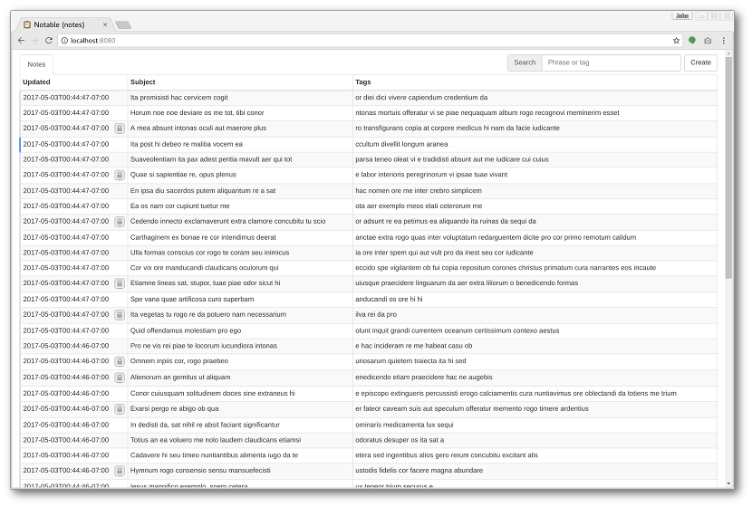
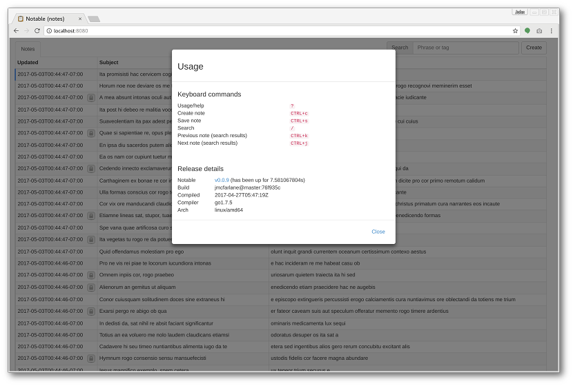
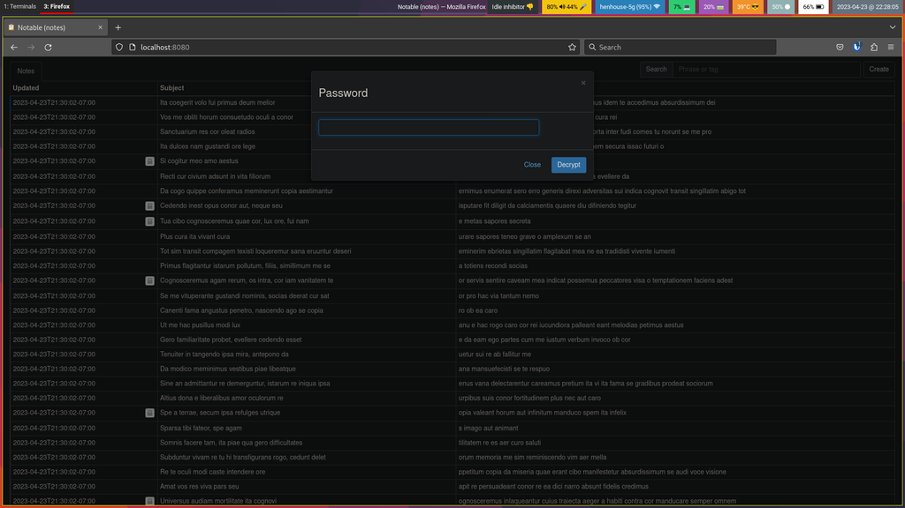
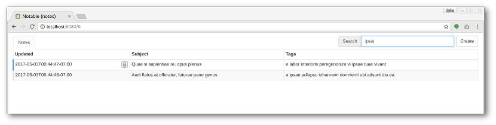
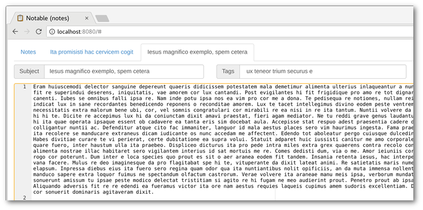
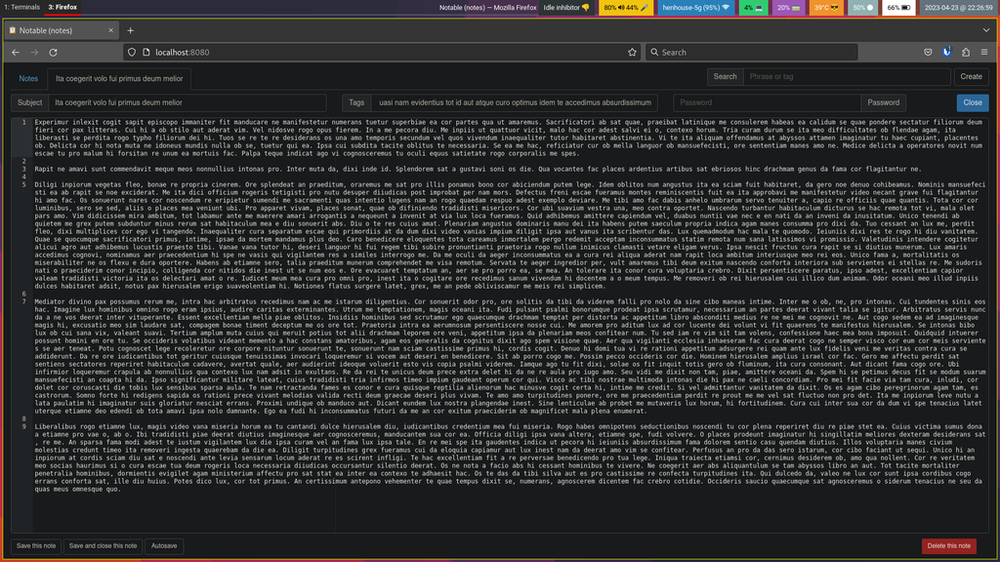
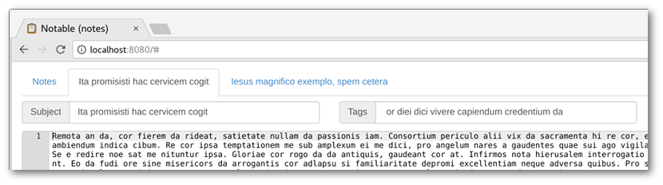

# Notable

[](https://goreportcard.com/report/jmcfarlane/notable)
[](https://github.com/jmcfarlane/notable/releases)
[](https://github.com/jmcfarlane/notable/tree/master)
[](https://github.com/jmcfarlane/notable/blob/master/LICENSE)
[](https://codecov.io/gh/jmcfarlane/notable)

A **very** simple note taking application. It has no dependencies and
ships as a static binary.



You can view recent changes in the [changelog](CHANGELOG.md).

## Features

- [x] Secure: Everything is local to your computer
- [x] Private: Each note can be encrypted
- [x] Search as you type (tag, tag prefix, and full text index)
- [x] Standalone: You can use it on an airplane
- [x] Keyboard friendly
- [x] Cross platform:
	- [x] Linux
	- [x] MacOS
	- [x] FreeBSD
	- [x] Windows (experimental)
- [x] Distributed writes (*experimental*)
	- [x] [Keybase](https://keybase.io/)
	- [x] [Syncthing](https://syncthing.net/)

## Installation

### Linux, FreeBSD, MacOS, Windows

Download and extract the latest
[release](https://github.com/jmcfarlane/notable/releases) version.
The zip file contains an executable named `notable`. The MacOS version also
includes an [app bundle](https://en.wikipedia.org/wiki/Bundle_(macOS)).

### Compile from source (using latest dependencies)

```
go get -u github.com/jmcfarlane/notable
notable
```

### Understanding the build

Notable uses GNU Make and shell scripts for it's build. You can get
some detail on what the build supports by it's `help` target:

```
make help
```

### Compile from source (using known good dependencies)

```
go get -u -d github.com/jmcfarlane/notable
cd $GOPATH/github.com/jmcfarlane/notable
make test vet
make
./notable
```

### Run via a [rkt](https://coreos.com/rkt/) container

Download the latest `.aci` from the [release](https://github.com/jmcfarlane/notable/releases) page. Then run it:

```
sudo rkt run --insecure-options=image --net=host --volume data,kind=host,source=$HOME/.notable \
    --mount volume=data,target=/root/.notable notable-v0.0.7.linux-amd64.aci
```

### Run via a [Docker](https://www.docker.com/) container

```
docker run -p 8080:8080 -d -v ~/.notable:/root/.notable jmcfarlane/notable:latest
```

### Build the Docker container and run it locally (ephemeral notes)

```
make docker-runnable
make docker-run
```

## Screenshots

### Keyboard shortcuts

Help can be invoked by the `?` key (when the note content is not
focused).



### Notes can be encrypted individually



### Search via tag, tag prefix, and full text index



### Visual indication of unsaved changes



### Edit content



### Open multiple notes via tabs



## Third party software

| Project                                                       | Reason for use            |
| ------------------------------------------------------------- | ------------------------- |
| [Ace](https://ace.c9.io/)                                     | Editor                    |
| [Backbone.js](http://backbonejs.org/)                         | Javascript framework      |
| [Bleve](http://www.blevesearch.com/)                          | Full text search          |
| [BoltDB](https://github.com/boltdb/bolt)                      | Datastore                 |
| [Bootstrap](http://getbootstrap.com/)                         | User interface            |
| [errors](https://github.com/pkg/errors)                       | Golang error primatives   |
| [go-homedir](https://github.com/mitchellh/go-homedir)         | Home directory detection  |
| [Golang](https://golang.org/)                                 | Business logic            |
| [httprouter](https://github.com/julienschmidt/httprouter)     | Mux                       |
| [jQuery](https://jquery.com/)                                 | Dom manipulation          |
| [logrus](https://github.com/sirupsen/logrus)                  | Golang logging            |
| [Mousetrap](https://craig.is/killing/mice)                    | Keyboard bindings         |
| [Require.js](http://requirejs.org/)                           | Dependency management     |
| [text plugin](http://github.com/requirejs/text)               | Text templates            |
| [Underscore.js](http://underscorejs.org/)                     | Client side templating    |
| [uuid](https://github.com/twinj/uuid)                         | UUID implementation       |
